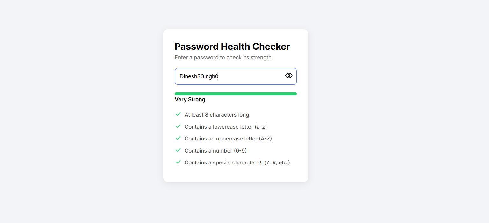

<!DOCTYPE html>
<html lang="en">
<head>
  <meta charset="UTF-8" />
  <meta name="viewport" content="width=device-width, initial-scale=1.0" />
</head>
<body style="font-family: Arial, sans-serif; line-height: 1.6; margin: 40px;">
  <h1>Password Strength Checker</h1>
  
Modern <strong>Password Health Checker</strong> built using HTML, CSS, and JavaScript.

  <h2>🚀 Live Demo</h2>
  

    <a href="http://dineshsinghdhami.com.np/password-strength-checker" target="_blank">
      http://dineshsinghdhami.com.np/password-strength-checker
    </a>
  

  <h2>🖼️ Screenshot</h2>
 

  <h2>📁 Project Structure</h2>
  <pre>
project-folder/
│
├── index.html        
├── readme.html       
└── screenshot.png/         
  </pre>

  <h2>🛠 Tech Stack</h2>
  <ul>
    <li>HTML</li>
    <li>CSS</li>
    <li>JavaScript</li>
  </ul>
  
  <h2>✨ Features</h2>
  <ul>
    <li>Real-time password strength evaluation</li>
    <li>Strength categories: Weak, Medium, Strong, Very Strong</li>
    <li>Animated progress bar</li>
    <li>Checklist showing rule satisfaction</li>
    <li>Show/Hide password eye toggle</li>
  </ul>

  <h2>📌 Password Requirements</h2>
  <ul>
    <li>Minimum 8 characters</li>
    <li>At least one lowercase letter</li>
    <li>At least one uppercase letter</li>
    <li>At least one number</li>
    <li>At least one special symbol</li>
  </ul>

  <h2>⚙️ How It Works</h2>
  
JavaScript listens to input events and:

  <ul>
    <li>Validates using regex-based rules</li>
    <li>Updates progress bar width + color</li>
    <li>Shows check / cross icons for each requirement</li>
    <li>Displays strength text dynamically</li>
  </ul>

  <h2>© Copyright</h2>
  
© 2025 Dinesh Singh Dhami. All rights reserved.

  <h2>👤 Owner</h2>
  
<strong>Dinesh Singh Dhami</strong> Bachelor in Computer Engineering, NAST College

</body>
</html>
